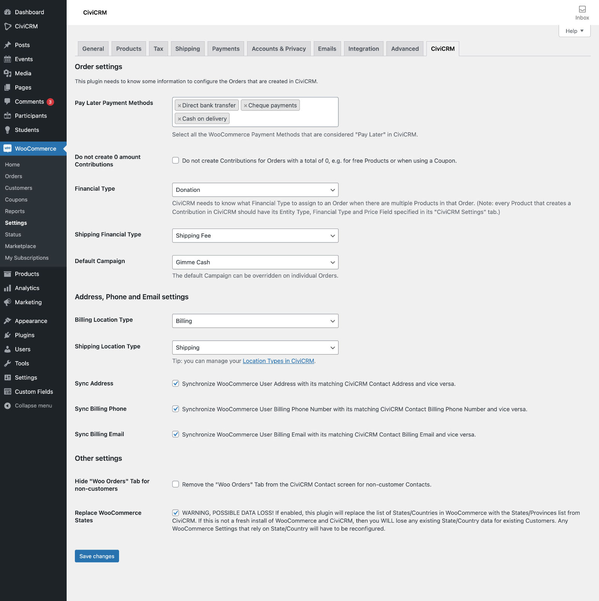
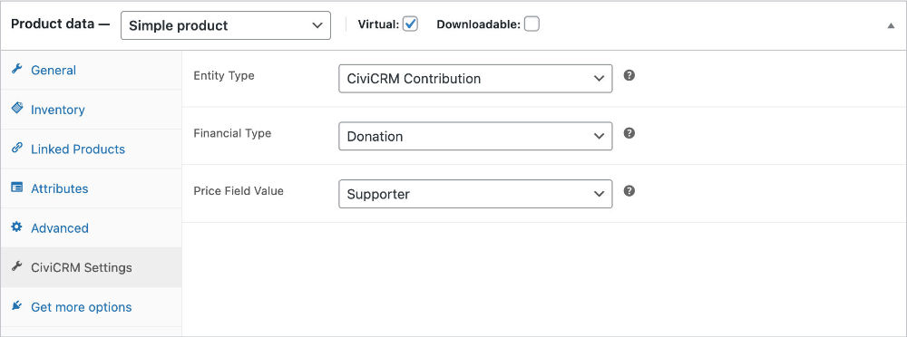
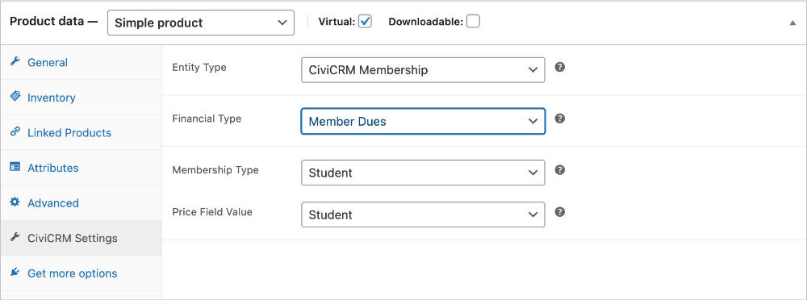
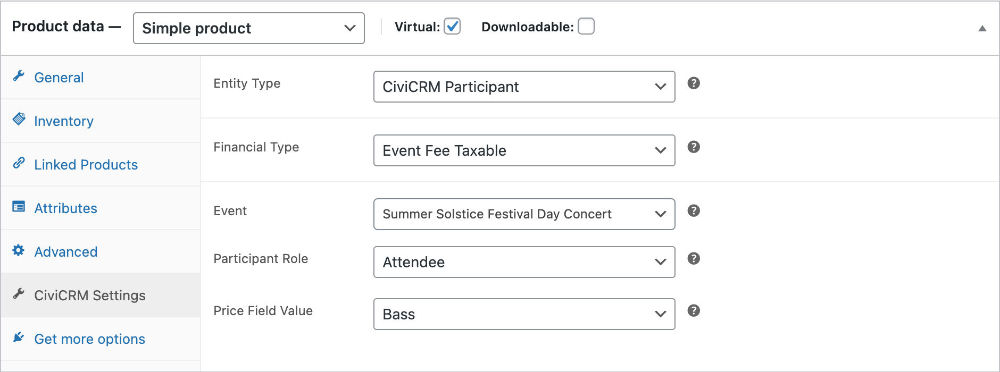
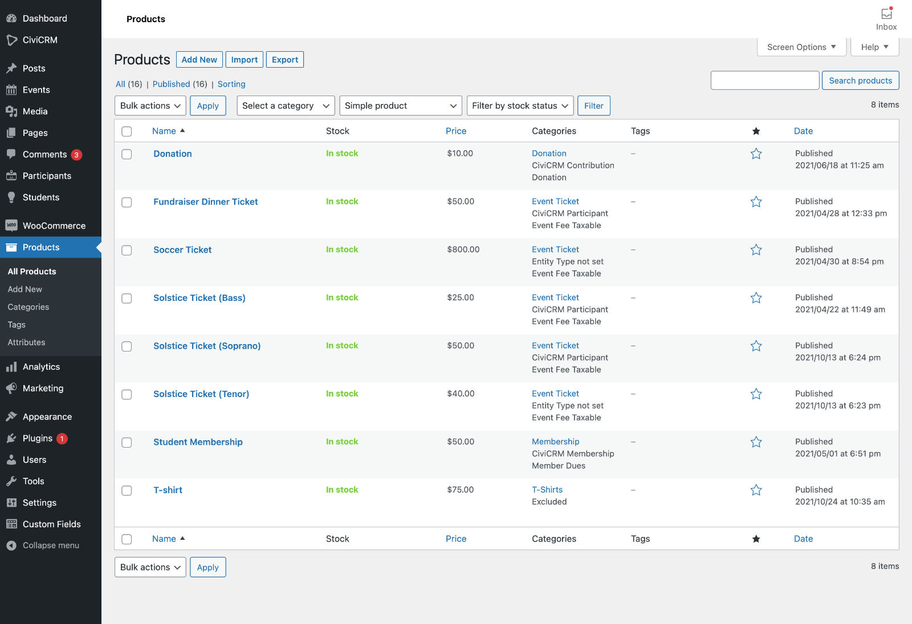
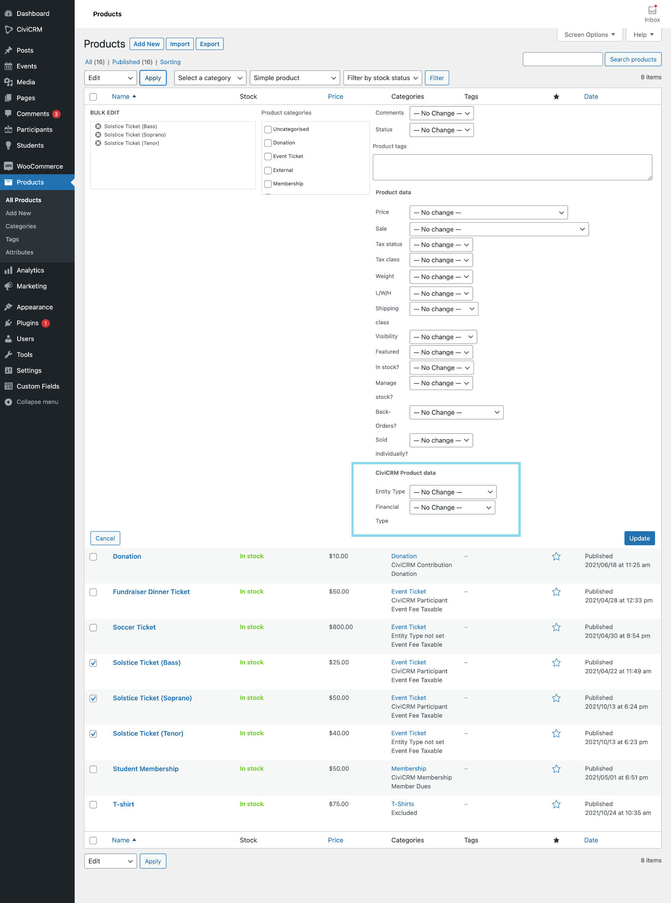
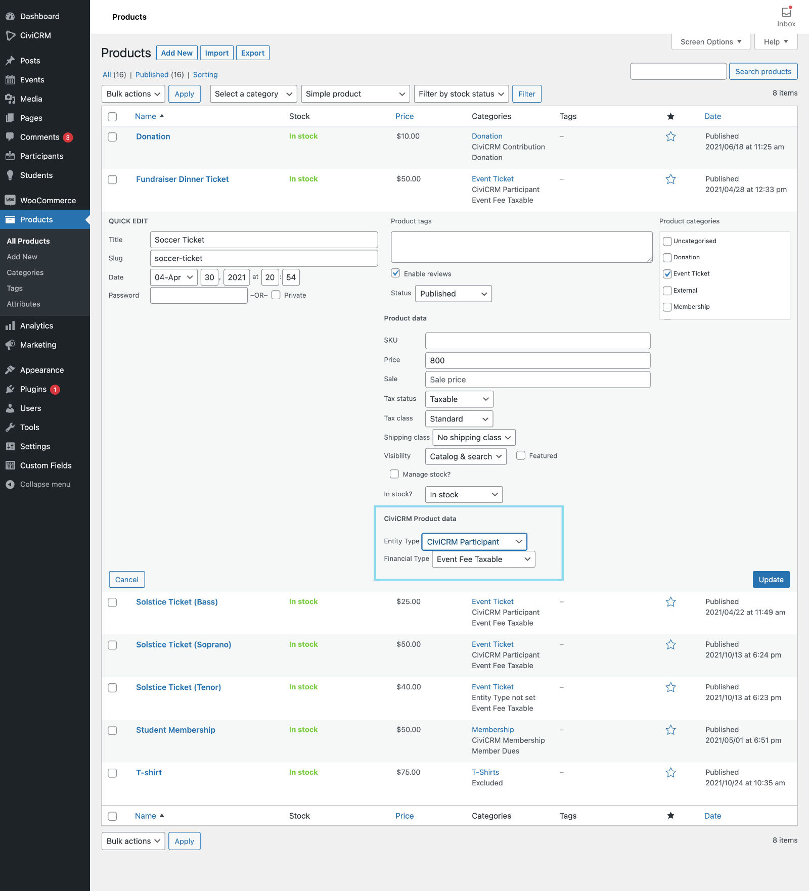
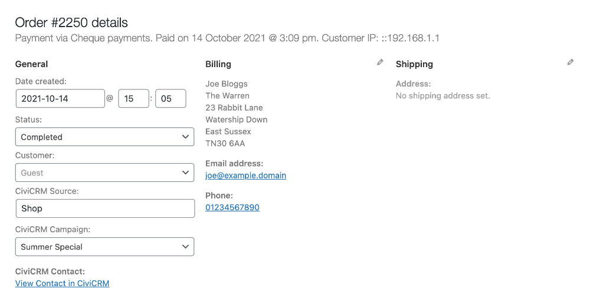

# Setup

## Customer Accounts

Enableing two-way syncing of Address, Billing Phone, and Billing Email between CiviCRM and WooCommerce means that when a User edits their Address, Billing Phone, or Billing Email through their WooCommerce Account page, their CiviCRM Profile, or through CiviCRM's admin interface, the data will be updated in both CiviCRM and WooCommerce.

## State/Province sync

**Important note** Selecting the option to replace WooCommerce's States/Counties list with CiviCRM's State/Province list will cause **States/Counties data loss** for **existing Customers** and the **WooCommerce settings** that rely on those. It is best to do the replacement when first this plugin and WooCommerce are first installed.

## Plugin Settings

### General Settings

Configure general integration settings in *WooCommerce* &rarr; *Settings* &rarr; *CiviCRM* Tab

### Individual Product Settings

Configure settings for a Product in the *CiviCRM Settings* Tab.

#### Product that creates a CiviCRM Contribution

#### Product that creates a CiviCRM Membership

#### Product that creates a CiviCRM Participant

### Product Bulk and Quick Edit

The Products Listing table shows information about how each Product is configured with respect to CiviCRM.

You can use Bulk Edit and Quick Edit functionality to edit the "Entity Type" and "Financial Type" of a Product. More granular settings must be made on the *CiviCRM Settings* Tab on the individual "Edit Product" page.

### Individual Order Settings

Configure settings for an Order in the *General* section of the "New Order" and "Edit Order" screens.

